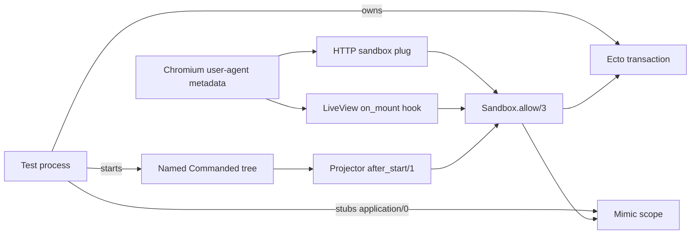

# Commanded sandbox example

A small Phoenix application demonstrating **async Commanded + Ecto tests**, including real Chromium feature tests with HTTP and LiveView sandbox forwarding.

The first Git commit is an untouched Phoenix 1.8.13 application generated with:

```sh
mix phx.new commanded_sandbox_example --app sandbox_demo --module SandboxDemo \
  --no-install --no-version-check --no-agents-md
```

Everything after that commit is the example. The article publishing flow is inspired by [Conduit](https://github.com/slashdotdash/conduit); this is a fresh Phoenix application, not a port of Conduit's older dependency stack.

## Run it

Requires Elixir 1.20, Erlang/OTP 29, Node.js 24 or newer, and PostgreSQL. Development and test databases are `sandbox_demo_dev` and `sandbox_demo_test`, using `postgres` / `postgres` on localhost. Set `DATABASE_PORT` if your PostgreSQL port differs from 5432.

```sh
# Optional, if PostgreSQL is not already running:
docker compose up -d

mix deps.get
npm --prefix assets ci
npm --prefix assets run browser:install
mix setup
mix phx.server
```

Visit [localhost:4000/articles](http://localhost:4000/articles). `mix setup` creates an example author. The form dispatches a command; a Commanded projector writes the article to SQL and broadcasts an update to the LiveView.

The in-memory event store is deliberately used in **all environments** to keep this example small. Events and aggregate state disappear on application shutdown; SQL rows do not. This is a testing example, not a production persistence configuration. Use a durable Commanded adapter in a production application.

## Run the tests

```sh
# First-time test assets; mix test creates and migrates the test database.
MIX_ENV=test mix assets.build
mix test

# Core isolation and restart coverage only:
mix test --exclude feature

# Real Chromium feature coverage only:
mix test test/sandbox_demo_web/articles_browser_test.exs

# Keep browser traces for debugging:
PW_TRACE=true mix test test/sandbox_demo_web/articles_browser_test.exs
```

On Linux, install Chromium's operating-system dependencies once with:

```sh
npm --prefix assets exec -- playwright install chromium --with-deps
```

The endpoint binds to loopback on an ephemeral port during tests. PhoenixTest gets the actual port from `SandboxDemoWeb.Endpoint.server_info(:http)`, so no fixed test server port is necessary. CI runs both the core and browser tests.

## One application

There is only one OTP application, `:sandbox_demo`:

- `SandboxDemo.Application` is the normal Phoenix OTP supervision tree. The repo, endpoint, and Phoenix PubSub remain running throughout the suite.
- `SandboxDemo` is the main public API **and** the Commanded application module. It exposes `application/0`, `publish_article/1`, and the readers. There is no separate Distro-style application or runtime-selector module.
- Outside tests, the generated OTP supervisor also starts `SandboxDemo` and its article projector. In tests, each test supervises fresh, named instances of those two children.

## How isolation works

1. **SQL:** Phoenix's generated `DataCase` starts an Ecto sandbox owner and registers its cleanup with `on_exit`. The browser case delegates SQL checkout and browser metadata setup to `PhoenixTest.Playwright.Case`.
2. **Commanded:** `test/support/commanded_sandbox.ex` starts `{SandboxDemo, name: test_application}` with a fresh in-memory event store and aggregate tree. Names are reused per test module / declared ExUnit parameter set, not allocated as atoms per test execution.
3. **Application selection:** Mimic stubs `SandboxDemo.application/0` for the test process. All application lookups stay qualified, including `SandboxDemo.application()` inside `SandboxDemo`; a local `application()` call bypasses the stub.
4. **Projection processes:** The projector's standard Commanded `after_start/1` callback runs an optional `state.on_start` function. The test supplies a callback that grants Ecto and Mimic allowances from inside the projector, then signals readiness. Restarting the projector runs the callback again.
5. **Checkpoint isolation:** Each projector gets a name containing its test application name. Ecto projection checkpoints are keyed by this name in SQL; sharing a name would make concurrent transactions contend for the same row.
6. **Teardown:** `start_supervised!` puts the Commanded tree under ExUnit supervision. ExUnit stops it before running the SQL owner's `on_exit` cleanup. There is no application restart, sleep, or global environment mutation between tests.

Phoenix's browser sandbox enables exit trapping. Commanded's local PubSub registry links subscribers, so `ArticlesLive` explicitly exits with `:shutdown` when that registry shuts down. This preserves normal linked-process shutdown while the browser context is still closing.

Strong dispatch consistency makes the form wait for its SQL projection. It does not provide test isolation by itself, nor does it transitively wait for arbitrary commands dispatched by other handlers.

## Forwarding to browser requests and LiveViews



The forwarding follows Phoenix's documented acceptance-test setup:

- `endpoint.ex` installs `Phoenix.Ecto.SQL.Sandbox` **only in test**, before other plugs, and includes `:user_agent` in the LiveView connection info.
- `test/support/sandbox_hook.ex` runs at LiveView mount, retrieving the same metadata and allowing the LiveView process.
- `test/support/web_sandbox.ex` is a small adapter that performs both `Ecto.Adapters.SQL.Sandbox.allow/3` and `Mimic.allow/3`.

The metadata refers to the **test process**, which owns the Mimic stub and is already allowed by Ecto's separate SQL owner. Giving access only to SQL is insufficient: the request / LiveView also needs to select the test's named Commanded application.

If you add authentication hooks in `live_session`, place the sandbox hook before hooks that read SQL. Independently spawned processes need the same allowances. Out-of-process job executors do not automatically inherit this test scope.

## What the tests demonstrate

- `test/sandbox_demo/isolation_test.exs`: concurrent ExUnit parameter sets reuse the same article / aggregate ID. Each starts with no events or SQL rows, successfully publishes once, rejects a duplicate, and observes exactly its own event at stream version 1. SQL rollback alone would leave the shared aggregate's `already_published` state behind.
- `test/sandbox_demo/projector_restart_test.exs`: terminate and restart the projector, then publish again. Both the new SQL row and scoped PubSub message must reach the test.
- `test/sandbox_demo_web/articles_browser_test.exs`: two parameter sets run browser sessions asynchronously. Each creates an uncommitted author in its SQL transaction, selects that author in a real LiveView, publishes through the browser, and reads back the row and event from the test process. A second command from the test updates the already-connected page through the projector's PubSub broadcast.

## Verification

Verified locally on 2026-09-11 with PostgreSQL 18 and real Chromium:

- Full suite: 10 tests pass, including both browser parameter sets.
- Core-only suite: 8 tests pass, 2 feature tests excluded.
- Formatting, compilation with warnings treated as errors, and asset builds pass.
- Development setup, default application dispatch, and SQL projection pass without Mimic or test sandbox setup.

The following temporary changes were also checked individually, then reverted:

| Change | Expected failure observed |
| --- | --- |
| Remove `Ecto.Adapters.SQL.Sandbox.allow/3` from the forwarding adapter | Both browser tests fail with `DBConnection.OwnershipError` during HTTP rendering. |
| Remove `Mimic.allow/3` from the forwarding adapter | Both browser tests fail because the connected LiveView selects the unstarted default Commanded application. |
| Replace `SandboxDemo.application()` with local `application()` inside `publish_article/1` | Both isolation parameter sets fail because dispatch selects the unstarted default Commanded application. |

These controls show that the passing tests depend on SQL forwarding, Mimic forwarding, and qualified application lookup. The GitHub Actions workflow is provided; the verification above was run locally.

## Versions

Resolved from current stable packages on 2026-09-11; the exact dependency graph is committed in `mix.lock` and `assets/package-lock.json`.

| Component | Version |
| --- | --- |
| Phoenix / generator | 1.8.13 |
| Phoenix LiveView | 1.2.11 |
| Ecto / Ecto SQL | 3.14.2 / 3.14.0 |
| Phoenix Ecto | 4.7.0 |
| Commanded | 1.4.11 |
| Commanded Ecto projections | 1.4.0 |
| Mimic | 2.4.0 |
| PhoenixTest Playwright | 0.17.0 |
| Playwright | 1.63.0 |

## References

- [Commanded: dynamic named applications](https://hexdocs.pm/commanded/Commanded.Application.html#module-dynamic-named-applications)
- [Commanded Ecto projections: runtime configuration](https://hexdocs.pm/commanded_ecto_projections/usage.html#runtime-configuration)
- [Commanded event handler: after_start/1](https://hexdocs.pm/commanded/Commanded.Event.Handler.html#c:after_start/1)
- [Phoenix Ecto: acceptance tests with LiveViews](https://hexdocs.pm/phoenix_ecto/Phoenix.Ecto.SQL.Sandbox.html#module-acceptance-tests-with-liveviews)
- [Ecto SQL sandbox: allowances](https://hexdocs.pm/ecto_sql/Ecto.Adapters.SQL.Sandbox.html#module-allowances)
- [Mimic](https://hexdocs.pm/mimic/Mimic.html)
- [PhoenixTest Playwright](https://hexdocs.pm/phoenix_test_playwright/)
- [Conduit](https://github.com/slashdotdash/conduit)
